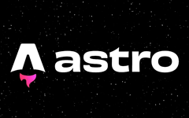

<div align="center">
  <a href="">
    
  </a>

  <p />
  <p>
    <b>
      Modern personal portfolio built with Astro and TypeScript, focused on performance, clean UI and professional presentation.
    </b>
  </p>

  <p align="center">
    <a href="">Live Demo</a>
    <span>&nbsp;&nbsp;✦&nbsp;&nbsp;</span>
    <a href="#-introduction">Introduction</a>
    <span>&nbsp;&nbsp;✦&nbsp;&nbsp;</span>
    <a href="#-stack">Stack</a>
    <span>&nbsp;&nbsp;✦&nbsp;&nbsp;</span>
    <a href="#-features">Features</a>
    <span>&nbsp;&nbsp;✦&nbsp;&nbsp;</span>
    <a href="#-project-structure">Project Structure</a>
  </p>
</div>

---

## 📝 Introduction

This is my personal developer portfolio, created to showcase my professional experience, technical stack and selected projects. The project focuses on performance, accessibility and clean component architecture using modern web technologies. It is deployed in production with a custom domain and optimized for SEO and fast loading.

---

## 🛠️ Stack

- ⚡ [**Astro**](https://astro.build/) – Modern server-first framework
- 🟦 [**TypeScript**](https://www.typescriptlang.org/) – Strongly typed JavaScript
- 🎨 [**Tailwind CSS**](https://tailwindcss.com/) – Utility-first styling
- 🧩 [**Vue.js**](https://vuejs.org/) – Component-based UI development
- 🌐 [**Node.js**](https://nodejs.org/es) – Backend services and APIs
- ☁️ [**Vercel**](https://vercel.com/) – Deployment and hosting

---

## ✨ Features

- Clean and modern UI design
- Fully responsive layout
- Optimized performance and SEO
- Structured sections (About, Skills, Experience, Projects, Contact)
- Production deployment with custom domain
- Modular and scalable architecture

---

## 📁 Project Structure

```bash
src/
├── components/
├── layouts/
├── pages/
├── data/
├── styles/
└── assets/

public/
docs/
```
